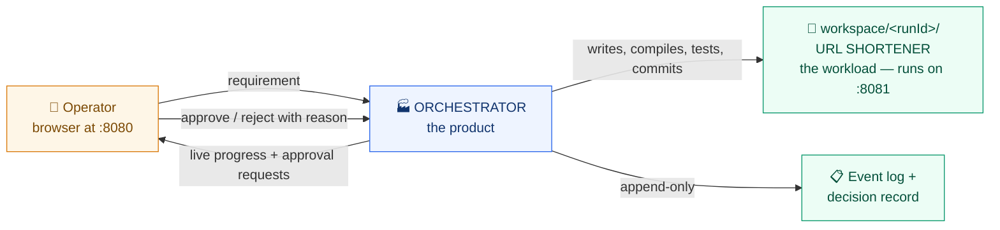
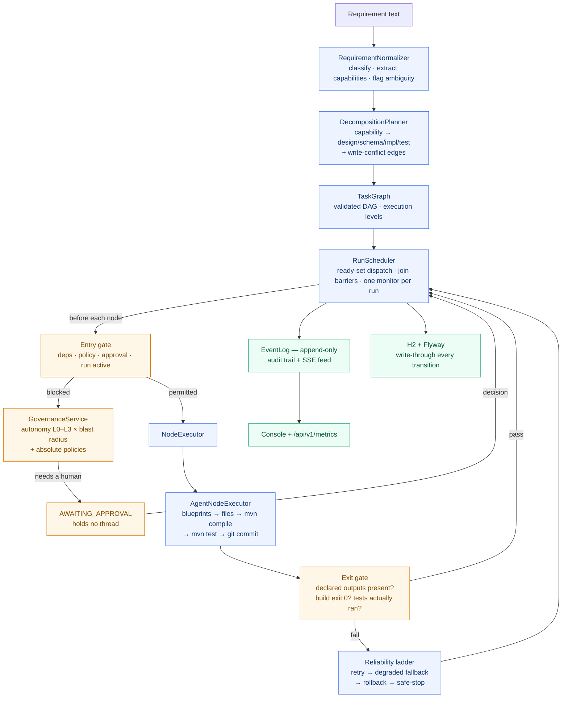
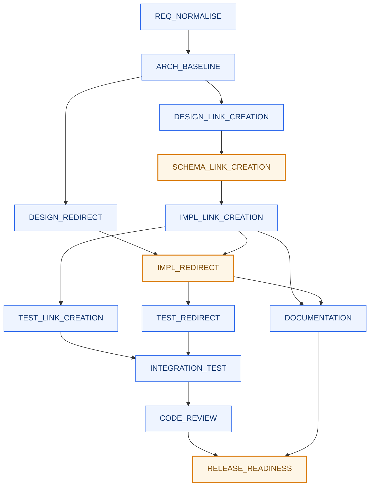

# Agentic SDLC Orchestrator

**The orchestrator is the product. The URL shortener is the workload it builds.**

Give it a requirement in English. It decomposes that into a dependency graph, executes the graph with
real parallelism, stops for a human wherever policy says it must, writes real Java, compiles it, runs
its tests, commits each node separately — and refuses to mark anything green that cannot show
evidence.

Section 4 of the brief describes a workflow engine, not a URL shortener. The shortener exists to
prove the engine produces working software rather than a plan document.

| Increment | Delivers |
|---|---|
| 1 | **Requirement decomposition** — requirement in, task graph with dependencies and sequencing out (CR2, CR4.2) |
| 2 | **Execution engine** — asynchronous run of the graph with real parallelism, join barriers, failure propagation, an append-only event log, safe-stop (CR4.0, CR4.4, CR4.9) |
| 3a | **Governance** — entry/exit gates, non-blocking human approvals, policy engine, autonomy levels L0–L3, decision log (CR4.3, CR4.5, CR4.6, CR4.8, CR7) |
| 3b | **Persistence** — H2 + Flyway, write-through on every transition, startup recovery; a run parked on a human survives a restart |
| 4a | **Reliability** — bounded retry with backoff, node timeouts, degraded fallback, compensating rollback, pause/resume (CR4.7) |
| 4b | **Dynamic re-planning** — content fingerprints, plan diffing, invalidation cascade, oscillation and churn bounds, governed plan admission (CR4.10) |
| 5 | **Agents + sandboxed tools** — path-jailed filesystem, allowlisted process execution, real `mvn` and `git`, content screening, evidence-backed exit gates, git-revert compensation |
| 6 | **Observability** — reliability metrics, SSE live feed, and a console UI that drives the whole system from a browser (CR4.9, CR4.10, CR7) |

Still to come: the three scenario write-ups and the engineering summary. See
[`../PROJECT-PLAN.md`](../PROJECT-PLAN.md).

---

## Architecture

### The two programs



Two separate programs. The orchestrator runs on **8080**; the service it generates runs on **8081**.
Both can run at once.

### Inside the orchestrator



### A greenfield run's graph

Orange stops for a human. Side-by-side boxes run in parallel.



`IMPL_REDIRECT` and `IMPL_LINK_CREATION` are serialised by a **CONTROL** edge because both write
`LinkService.java` — the planner detects write conflicts and orders them, recording the reason.

### The five rules everything else follows from

| # | Rule | Consequence |
|---|---|---|
| 1 | **A node may never declare its own success** | The exit gate checks declared outputs, compiler exit code and test totals. A node reporting success while producing nothing *fails*. `tests.run == 0` fails — a suite that ran nothing proves nothing. |
| 2 | **Waiting is a state, never a blocked thread** | `AWAITING_APPROVAL` and `RETRYING` hold nothing. Other branches keep running; a run can wait days and survive a restart. |
| 3 | **Everything read and written is declared** | Gives content fingerprints for re-planning, least-privilege context per agent, and the evidence the gate checks. |
| 4 | **Autonomy tunes approval; policy is absolute** | A `DENY` halts an L3 run exactly as it halts an L0 one. A task assigned to a human is never executed by an agent, at any level. |
| 5 | **Failure is local and reversible** | A failed node blocks only its transitive dependents. One git commit per node, so rollback is a precise `git revert`. |

### Component map

| Package | Responsibility |
|---|---|
| `requirement` | Normalise text, classify GREENFIELD/BROWNFIELD/AMBIGUOUS, build the ambiguity register |
| `plan` | Capability-driven decomposition, DAG validation, write-conflict resolution, execution levels |
| `execution` | Async scheduler, node state machine, entry/exit gates, append-only event log |
| `governance` | Autonomy matrix, policy engine, approvals, decision record |
| `reliability` | Bounded retry, timeouts, degraded fallback, compensating rollback |
| `replan` | Fingerprints, plan diff, invalidation cascade, oscillation bounds |
| `sandbox` / `tools` | Path jail, executable allowlist, content screening, `mvn` and `git` |
| `agent` | The blueprint runtime and the real file-writing executor |
| `metrics` / `api` | Reliability metrics derived from the event log; REST + SSE + console |

---

## Prerequisites

```bash
sudo apt update && sudo apt install -y openjdk-21-jdk git
export JAVA_HOME=/usr/lib/jvm/java-21-openjdk-amd64
```

Nothing else — Maven comes from the wrapper. `git` is needed only in agent mode, where the
orchestrator commits each node's work.

> **Never run the build or the server with `sudo`.** It leaves root-owned `target/`, `workspace/`
> and `.git` directories, and every later command fails with a `Permission denied` that looks like a
> code problem:
>
> ```
> [ERROR] filtering .../src/main/resources/application.properties to
>         .../target/classes/application.properties failed with
>         FileNotFoundException: ... (Permission denied)
> ```
>
> Recover with `sudo chown -R $USER:$USER /home/inpixon/learning`, or `sudo rm -rf target`.

**On Windows:** a JDK 21 and Git for Windows, then use `mvnw.cmd` in place of `./mvnw` throughout.
Agent mode also needs **Maven on `PATH`** — `mvn -v` must work in the same shell — because the
generated project ships no wrapper of its own and the orchestrator builds it with the host's
`mvn.cmd`. The rest is handled: the right executable name is chosen per platform, git's CRLF
translation is disabled inside each run's workspace, and the path jail refuses names Windows would
rename or swallow.

## Build

```bash
cd orchestrator
./mvnw test          # 215 tests, ~2 minutes  (mvnw.cmd test on Windows)
```

---

## Two modes

The orchestrator ships with two node executors, chosen by one property. Everything else — the
scheduler, gates, governance, retries, rollback, re-planning — is identical in both.

| Mode | Property | What a node does | Use it for |
|---|---|---|---|
| **Simulated** *(default)* | `orchestrator.executor=simulated` | Reports plausible outputs after a short delay; failures can be injected | Fast demos of scheduling, governance, failure handling. Whole run finishes in seconds |
| **Agent** | `orchestrator.executor=agent` | Writes real files, runs `mvn compile` / `mvn test`, commits with `git` | Proving the system actually builds software. Minutes, not seconds |

Start simulated to understand the machine; switch to agent to watch it produce a working service.

## Run

```bash
./mvnw spring-boot:run -Dspring-boot.run.arguments=\
"--orchestrator.executor=agent --orchestrator.node-timeout-ms=900000"
```

Open **http://localhost:8080**.

| Flag | Why it matters |
|---|---|
| `--orchestrator.executor=agent` | **Without it the run is simulated** — it finishes in seconds and writes no files. The default is `simulated`, which is useful for demonstrating scheduling and governance quickly. |
| `--orchestrator.node-timeout-ms=900000` | Real Maven builds exceed the 30-second default and get killed mid-build. |

To start from a clean slate: stop the server and `rm -rf data workspace`.

---

## The console

`http://localhost:8080` once the server is up. Six screens, all pure REST clients — every button is
one API call, so anything the browser can do, `curl` can do.

| Screen | What it is for |
|---|---|
| **Dashboard** | Live metrics strip (success rate, retry rate, MTTR, rollbacks, latency, approval wait) and every run |
| **New Run** | Requirement text, three scenario presets, autonomy level, and a plan preview that executes nothing |
| **Run detail** | Live dependency DAG coloured by node state, node table, streaming event log, decision lineage, and the pause / resume / stop / rollback / re-plan controls |
| **Node inspector** | Click any node: reads, writes, acceptance criteria, why each dependency exists, full event history |
| **Approvals** | The inbox — impact, blast radius, every triggering policy, and approve / reject with guidance |
| **Policies** | The guardrail catalogue with the rationale for each rule |

The DAG is laid out natively rather than by a diagramming CDN, so it renders on a machine with no
network. Live updates arrive over SSE (`/api/v1/runs/{id}/stream`), which replays from a sequence
number on reconnect — so a dropped connection loses nothing.

---

## What you can ask for

**There is no LLM anywhere in this system.** Your text is not "understood" — it is matched, on word
boundaries, against a fixed catalogue of eight capabilities. Two seams would each need a model and
neither has one: `RequirementNormalizer` (understanding arbitrary English) and `AgentRuntime`
(synthesising code). Knowing that is the difference between a prompt that works and one that quietly
produces a placeholder.

### The prompts to use

```
Build a URL shortener service with shorten and redirect APIs      → GREENFIELD, 13 nodes
Add click analytics and rate limiting to the existing service     → BROWNFIELD, 14 nodes
Add caching and monitoring to the current service                 → BROWNFIELD, caching + observability
Make the URL shortener more reliable and faster                   → AMBIGUOUS, 2 nodes, stops at CLARIFY
```

The first three are the console's **Scenarios** chips. Those chips only paste text into the box —
they send no scenario override, so **the classification comes from your words, not the button you
clicked.** Edit a preset to say "Build a new…" and a brownfield chip gives you a greenfield run.

### The eight capabilities, and their trigger words

| Capability | Any of these words detects it | Produces code? |
|---|---|---|
| Link creation | `shorten` · `short link` · `short url` · `create link` · `generate code` | ✅ |
| Redirect | `redirect` · `resolve` · `302` · `follow link` · `look up code` | ✅ |
| Click analytics | `analytics` · `click` · `stats` · `statistics` · `tracking` · `track` | ✅ |
| Rate limiting | `rate limit` · `throttle` · `abuse` | ✅ |
| Caching | `cache` · `caching` · `in-memory lookup` | ✅ |
| Observability | `observability` · `monitoring` · `health check` · `metrics endpoint` · `structured logging` | ✅ |
| **Link management** | `expire` · `expiry` · `ttl` · `alias` · `delete link` · `deactivate` | ❌ **placeholder** |
| **Authentication** | `authentication` · `api key` · `oauth` · `login` · `bearer token` | ❌ **placeholder** |

Plurals and `-ing` are absorbed, so `clicks` and `rate limiting` both match. `"URL shortener"` is
deliberately **not** a keyword: it names the product, not a feature, and reading it as a request to
build link creation is how an ambiguous requirement becomes a confidently wrong plan.

> **The last two rows are the trap.** They plan perfectly — `DESIGN_AUTHENTICATION`,
> `SCHEMA_AUTHENTICATION`, `IMPL_AUTHENTICATION`, `TEST_AUTHENTICATION` all appear in the graph — but
> the blueprint runtime has no case for them. In **agent** mode those nodes return `unsupported`,
> exhaust their retries and fall through to the degraded fallback, which writes a markdown file
> saying *"this is not an implementation"*. The run ends with a non-zero `degraded` count rather than
> a clean success. In **simulated** mode you would never notice. That makes
> `"Add API key authentication and link expiry"` an excellent prompt for demonstrating the
> reliability ladder and a poor one for demonstrating code generation.

### How the scenario is decided

In this order, by `RequirementNormalizer.classify`:

1. **No capability detected at all → `AMBIGUOUS`.** That is the entire rule. Planning stops at a
   human `CLARIFY` task rather than inventing work.
2. Contains `build ` · `create ` · `from scratch` · `new service` · `implement a` · `stand up` →
   **GREENFIELD**; prerequisites are built.
3. Contains `add ` · `extend` · `enhance` · `fix ` · `existing` · `refactor` · `modify` ·
   `improve the` · `current` → **BROWNFIELD**; prerequisites are assumed to exist already.
4. Neither signal → greenfield. Planning work you did not need is visible and cheap to correct;
   silently assuming code exists that does not fails much later and far more confusingly.

Brownfield also needs **Continue from an earlier run** set in the New Run screen. A change to
existing code needs existing code — without it, impact analysis reads an empty directory.

Independently of scenario, nine vague words — `reliable` · `faster` · `performance` · `scalable` ·
`secure` · `better` · `improve` · `robust` · `production ready` — each add an entry to the
**ambiguity register**, with the question they beg and the options they could mean.

### Asking for something outside the catalogue

"Add a comment system", "support QR codes" and the like detect nothing and are classified
`AMBIGUOUS`. That is the system working, not failing: it refuses to produce a plan for a domain it
has no model of. The honest framing is that the planner reasons about **one domain's dependency
structure deeply**, rather than pattern-matching arbitrary English broadly — which is what
`CapabilityCatalog`'s own javadoc says.

---

## Testing

Everything below is driven from the browser. Each scenario ends with an independent `mvn test` on
the generated code — do not take the orchestrator's word for it. For the `curl` equivalents, see
*Driving it from the shell* after the scenarios.

### Scenario 1 — Greenfield

**Requirement:** `Build a URL shortener service with shorten and redirect APIs`

New Run → **Greenfield** preset → Start. Approve when the amber panel appears.

| Expected | Value |
|---|---|
| Plan shape | 13 tasks, 17 dependencies, GREENFIELD |
| Approvals | 3 — `SCHEMA_LINK_CREATION`, `IMPL_REDIRECT`, `RELEASE_READINESS` |
| Final | `COMPLETED`, 13/13 succeeded |
| Artifacts | 23 files, 13 git commits (one per node) |

```bash
cd workspace/<runId>
git log --oneline          # 13 commits, dependency order
mvn test                   # Tests run: 20, Failures: 0, Errors: 0
```

Run it:

```bash
mvn spring-boot:run        # binds :8081

curl -s localhost:8081/api/v1/links -H 'Content-Type: application/json' \
  -d '{"url":"https://example.com/a/very/long/link"}'
# -> 201 {"code":"aB3xY7q","shortUrl":"http://localhost:8081/aB3xY7q",
#         "targetUrl":"https://example.com/...","active":true}

curl -si localhost:8081/aB3xY7q | head -2      # 302, Location: the original
```

`POST /api/v1/links` also takes `alias` (409 if taken) and `expiresAt`. `GET /api/v1/links/{code}`
inspects; `DELETE` deactivates.

**Commits are the rollback mechanism.** Because each node commits separately, undoing one node is a
precise `git revert <sha>` rather than a guess about which files belonged to it.

### Scenario 2 — Brownfield

**Requirement:** `Add click analytics and rate limiting to the existing service`

A change to existing code needs existing code, so this run starts from scenario 1's workspace. Pass
`baseRunId` — the console's New Run screen has the field, or:

```bash
curl -s localhost:8080/api/v1/runs -H 'Content-Type: application/json' \
  -d '{"requirement":"Add click analytics and rate limiting to the existing service",
       "baseRunId":"<scenario-1-runId>"}'
```

| Expected | Value |
|---|---|
| Plan shape | 14 tasks, BROWNFIELD — `IMPACT_ANALYSIS` inserted before design |
| Approvals | 4 — schema, both implementations, release |
| Final | `COMPLETED`, 14/14 succeeded |
| Artifacts | Baseline seeded (22 files copied), then `V2__clicks.sql`, analytics and rate-limiting classes |

```bash
cd workspace/<runId>
mvn test                   # 34 tests across 7 classes, 0 failures
```

**What to look for:** `docs/impact-analysis.md` is written *before* any code changes, and the
approval on `SCHEMA_CLICK_ANALYTICS` cites three converging rules — autonomy level, CHG-02
(migrations), CHG-03 (hot path). The strictest wins; a `WARN` never downgrades an `APPROVE`.

### Scenario 3 — Ambiguous

**Requirement:** `Make the URL shortener more reliable and faster`

Start it with `baseRunId` set to scenario 1, same as above.

**Stage 1 — it refuses to guess.** The plan is 2 tasks and stops at `CLARIFY`, gated by COM-01
("work assigned to a human must not be performed by an agent"). The ambiguity register names what is
unclear and offers options:

> `reliable` — *"unquantified. Which failure does it need to survive?"* → uptime under load / data
> durability / graceful degradation
>
> `faster` — *"no target or baseline. What is being measured?"* → redirect latency at p99 / creation
> throughput / cold-start

**Stage 2 — a human clarifies.** Run controls → **Re-plan…**:

```
Add caching for redirect latency and monitoring for reliability
```

| Expected | Value |
|---|---|
| Re-plan outcome | `AWAITING_PLAN_APPROVAL` — the plan change *itself* is governed |
| Diff | 15 added, `CLARIFY` removed, `REQ_NORMALISE` retained |
| Final | `COMPLETED`, 16/16 succeeded |

```bash
cd workspace/<runId>
mvn test                   # 28 tests, 0 failures
```

**What to look for:** the graph visibly changes shape from 2 nodes to 16, and completed work is
carried forward rather than redone.

### Failure handling

Each is one flag, in simulated mode (`--orchestrator.executor=simulated`).

| What to prove | Flag | What you see |
|---|---|---|
| A false claim of success is refused | `--orchestrator.simulation.omit-evidence-tasks=IMPL_LINK_CREATION` | Executor reports success, produces nothing, node fails anyway |
| Failure stays local | `--orchestrator.simulation.fail-tasks=IMPL_RATE_LIMITING` | Only transitive dependents block; other branches complete |
| Retry then degraded fallback | `--orchestrator.simulation.fail-tasks=TEST_REDIRECT` | `RETRY_SCHEDULED` → `RETRIES_EXHAUSTED` → `FALLBACK_ATTEMPTED` → `NODE_DEGRADED`, counted separately from succeeded |
| A hung node is killed | `--orchestrator.simulation.slow-tasks=IMPL_CACHING --orchestrator.node-timeout-ms=3000` | `NODE_TIMED_OUT` |
| Partial rollback escalates | `--orchestrator.simulation.compensation-failures=SCHEMA_LINK_CREATION` | Rollback **halts** and leaves the node `BLOCKED` rather than compounding a partial state |

The first of these is the single rule that separates an orchestrator from a progress bar. The last
matters for the opposite reason: compounding a known-partial state with further automatic changes is
exactly what should not happen, so the rollback stops and escalates instead.

**Rejection** needs no flag: reject any approval with guidance. The node `FAILED`, its dependents
`BLOCKED`, already-finished work stays `SUCCEEDED`, and the guidance is on the decision record.

**Restart recovery** needs no flag: let a run park on an approval, `Ctrl-C` the server, start it
again. The log prints `Recovered N plan(s) and N run(s); 1 still live`; the same approval is waiting
and approving it resumes the run.

**Re-planning mid-run** returns an outcome, not a boolean: `ADMITTED`, `AWAITING_PLAN_APPROVAL`,
`NO_CHANGE`, `OSCILLATION_DETECTED`, `BOUND_REACHED` or `REJECTED`. Adding something that touches the
hot path or the schema correctly returns `AWAITING_PLAN_APPROVAL`.

### Verification checklist

| # | Claim | How it was checked |
|---|---|---|
| 1 | The orchestrator is correct | `./mvnw test` — 215 tests |
| 2 | A requirement becomes a dependency graph | 13 / 14 / 2 nodes for the three scenarios |
| 3 | Independent nodes run in parallel | Event log shows two `NODE_STARTED` before either `NODE_SUCCEEDED` |
| 4 | Policy stops high-impact work | The run reaches `AWAITING_INPUT` unprompted |
| 5 | Waiting costs no thread | Other branches keep succeeding while one node waits |
| 6 | Decisions are attributable | `/runs/{id}/decisions` gives actor, choice, rationale |
| 7 | Rejection propagates correctly | Node `FAILED`, dependents `BLOCKED`, rest `COMPLETED` |
| 8 | It writes real, compiling code | `mvn test` in the workspace — 20 / 35 / 29 tests |
| 9 | The generated service works | `curl` shorten + redirect on :8081 |
| 10 | Work is attributable node by node | `git log --oneline` — one commit per node |
| 11 | State survives a restart | Kill mid-run, restart, approval still pending |
| 12 | Metrics distinguish "no data" from zero | `/api/v1/metrics` on a fresh start omits rates rather than reporting `0` |

---

## Driving it from the shell

The console is the fastest way through a demo, but nothing requires it. Paste these helpers once and
every step below works from a terminal.

```bash
API=localhost:8080/api/v1

# start a run and remember its id
run()      { RUN=$(curl -s $API/runs -H 'Content-Type: application/json' \
                    -d "{\"requirement\":\"$1\"}" | jq -r .id); echo "RUN=$RUN"; }

status()   { curl -s $API/runs/$RUN | jq '{status, counts}'; }
nodes()    { curl -s $API/runs/$RUN | jq -r '.nodes[] | "\(.state)\t\(.taskId)"'; }
events()   { curl -s $API/runs/$RUN/events | jq -r '.[] | "\(.seq)\t\(.type)\t\(.taskId // "-")"'; }
decisions(){ curl -s $API/runs/$RUN/decisions \
               | jq -r '.[] | "\(.actor)\t\(.taskId // "-")\t\(.choice)\n  \(.rationale)"'; }

pending()  { curl -s "$API/approvals?runId=$RUN" \
               | jq -r '.[] | select(.status=="PENDING")
                        | "\(.id)\t\(.taskId)\t\(.blastRadius)\n  \(.reasons | join("\n  "))"'; }
approve()  { curl -s -X POST "$API/approvals/$1/approve?decidedBy=sravan" | jq -c .; }
reject()   { curl -s -X POST "$API/approvals/$1/reject?decidedBy=sravan&guidance=$2" | jq -c .; }
approveAll(){ for id in $(curl -s "$API/approvals?runId=$RUN" \
                | jq -r '.[] | select(.status=="PENDING") | .id'); do approve $id; done; }

# one screen showing where the run is and what it is waiting for
watchRun() { watch -n 5 "curl -s $API/runs/$RUN | jq -c '{status, counts}';
                         echo; curl -s '$API/approvals?runId=$RUN' \
                           | jq -r '.[] | select(.status==\"PENDING\") | \"WAITING \(.id) \(.taskId)\"'"; }
```

> `run()` reads `.id`, which is what the response actually contains. Run ids begin `run-`; approval
> ids begin `apr-`. The two endpoints are not interchangeable.

**A one-minute smoke test (simulated).** Proves scheduling, gates, governance and the audit trail
without waiting for Maven:

```bash
run "Build a URL shortener service with shorten and redirect APIs"
status
# "status": "AWAITING_INPUT",  succeeded: 4,  awaitingApproval: 1,  pending: 8
```

**The run has parked, and that is the result, not a hang.** Ask what it wants, then grant it:

```bash
pending
# apr-7404a358   SCHEMA_LINK_CREATION   HIGH
#   Autonomy L2_DELEGATED requires APPROVE for HIGH blast radius.
#   [CHG-02] Schema migrations require approval (REQUIRE_APPROVAL). ...

approve apr-7404a358
```

Repeat until `status` reads `COMPLETED`, then read the evidence with `nodes`, `events` and
`decisions`. `approveAll` clears everything pending at once — fine for a re-run, but read `pending`
at least once: being shown exactly what you are consenting to is the feature.

**Prove the checkpoint actually stops things.** Rejecting is the more interesting half:

```bash
run "Build a URL shortener service with shorten and redirect APIs"
sleep 3
pending                                    # note the apr- id
reject apr-XXXXXXXX "Use a separate table"
sleep 4
nodes
# SCHEMA_LINK_CREATION  FAILED     <- the one you rejected
# IMPL_LINK_CREATION    BLOCKED    <- its transitive dependents
# ARCH_BASELINE         SUCCEEDED  <- the 4 that had already finished
```

Failure is local, and the guidance you typed is on the decision record, attributed to you.

---

## API

**Planning**

| Method | Path | Returns |
|---|---|---|
| `POST` | `/api/v1/decompose` | Task graph + summary; executes nothing |
| `GET` | `/api/v1/plans` | All plans |
| `GET` | `/api/v1/plans/{id}` | One plan |
| `GET` | `/api/v1/plans/{id}/mermaid` | Mermaid diagram source |
| `GET` | `/api/v1/plans/{id}/schedule` | Sequencing as plain text |

**Execution**

| Method | Path | Returns |
|---|---|---|
| `POST` | `/api/v1/runs` | `202` with a run id — the run is *scheduled*, not finished |
| `GET` | `/api/v1/runs` | All runs |
| `GET` | `/api/v1/runs/{id}` | Run status + per-node state |
| `GET` | `/api/v1/runs/{id}/events?since=N` | Append-only event log, pageable by sequence |
| `POST` | `/api/v1/runs/{id}/stop?reason=...` | Safe-stop |
| `POST` | `/api/v1/runs/{id}/pause?reason=...` | Hold; in-flight nodes finish |
| `POST` | `/api/v1/runs/{id}/resume` | Continue where it left off |
| `POST` | `/api/v1/runs/{id}/replan?guidance=...` | Rebuild the graph from an amended requirement |
| `POST` | `/api/v1/runs/{id}/rollback?reason=...` | Undo every succeeded node, most recent first |
| `GET` | `/api/v1/runs/{id}/decisions` | What was decided, by whom, and why |

**Oversight**

| Method | Path | Returns |
|---|---|---|
| `GET` | `/api/v1/approvals?status=&runId=` | The inbox — pending decisions with impact and triggering policies |
| `POST` | `/api/v1/approvals/{id}/approve?decidedBy=&note=` | Grant; the run resumes |
| `POST` | `/api/v1/approvals/{id}/reject?decidedBy=&guidance=` | Refuse; the node fails and dependents block |
| `GET` | `/api/v1/policies` | The guardrail catalogue |

**Observability**

| Method | Path | Returns |
|---|---|---|
| `GET` | `/api/v1/metrics` | Fleet-wide reliability metrics |
| `GET` | `/api/v1/metrics/runs/{id}` | The same, scoped to one run |
| `GET` | `/api/v1/runs/{id}/stream?since=N` | SSE feed — replays from `N`, then streams live |
| `GET` | `/api/v1/stream` | SSE feed for every run |

`POST /api/v1/runs` takes either `requirement` (decompose then run) or `planId` (run a plan you have
already inspected), plus an optional `autonomyLevel`, `scenarioHint` and `baseRunId`:

```json
{"requirement": "Add click analytics and rate limiting", "autonomyLevel": "L1_ASSISTED"}
```

Autonomy defaults to `L2_DELEGATED` — an unspecified level is an operator who has not thought about
it, and the safe reading of that is "still ask me about high-impact work".

Everything the console does is one of these calls; there is no orchestration logic in the browser.
There is deliberately no `/swagger-ui`: every endpoint is documented here, and springdoc is a
dependency and a classpath scan for no marginal evidence.

---

## Governance in one paragraph

An agent's claim of success is never accepted at face value: the **exit gate** checks it against the
evidence the task declared it would produce, plus the build's exit code and the test totals. Before a
node runs, the **entry gate** applies the **autonomy matrix** (how much you let agents do unattended)
and the **policy set** (what is not on the table at all). Autonomy tunes approval; policy is absolute
— a `DENY` halts an L3 run exactly as it halts an L0 one, and a task assigned to a human is never
executed by an agent at any level. A node needing approval sits in `AWAITING_APPROVAL` holding no
thread, while every other branch keeps running.

`GET /api/v1/policies` lists the guardrails: secrets denied outright, build-config and migration
changes requiring approval, human-owned tasks never automated, release gated, hot-path changes warned.

---

## The sandbox

In agent mode an agent can touch nothing outside its run's workspace.

- **Path jail.** Every path is normalised, checked for traversal, absolute paths, NUL bytes and
  overlong input — and then checked *again* against its real path, because a path can normalise
  cleanly inside the root and still resolve outside it through a symlink. For a file that does not
  exist yet, the parent's real path is checked, since a symlinked directory is enough.
- **The Windows name rules are enforced everywhere**, not only on Windows. A backslash is refused
  (a separator there, a filename character here — one string must not name two files); so is a
  segment ending in a dot or space, which Windows silently strips, and so is a reserved device name.
  `NUL` is the sharp one: opening it succeeds and discards everything written, so a node could
  "produce" its declared output, satisfy its exit gate, and have written nothing at all. Enforcing
  the union of both platforms' rules is what makes a run reproducible across hosts — the same
  property the deterministic runtime exists for. Only the length ceiling is per-platform, because
  only there does the host impose a different hard limit (259 on Windows without long paths).
- **No shell.** Arguments go straight to `execve`, so `; rm -rf .` is a nonsense argument, not a
  command substitution. One exception, and it is fenced: Maven on Windows is `mvn.cmd`, a batch file
  that `CreateProcess` cannot launch at all (`error=193`), so it goes through `cmd.exe /c`. Only
  build goals ever travel that path, and it is *checked* rather than assumed — a non-goal-shaped
  argument is refused. Agent-controlled text (commit messages, filenames) travels via `git`, a real
  executable with no interpreter near it.
- **Executable allowlist** — `mvn`, `mvnw`, `git`, `java`, matched on the base name with any
  `.cmd`/`.bat`/`.exe` suffix removed so the same tool is allowlisted once for every platform.
  Confining an agent's files while letting it run arbitrary binaries confines nothing. Only `mvnw`
  may be named by a *path*: the workspace is agent-writable, so letting any allowlisted name be
  reached by path would let an agent write its own `git` and be handed it.
- **Both process streams drained on separate threads** before `waitFor`; a process that fills its pipe
  buffer would otherwise deadlock against a wait that is itself waiting on us. Output capture is
  bounded, draining continues past the cap, and a process past its deadline is forcibly killed.
- **Environment stripped** of anything matching `TOKEN`, `SECRET`, `PASSWORD`, `API_KEY`, `_KEY`,
  `CREDENTIAL`.
- **Content screened before the write**, not after. A secret written and then deleted has still been
  on disk — and if the node committed, is still in history. Patterns match credential *shapes* (PEM
  blocks, `AKIA…`, `ghp_…`, `xox…`, `sk-ant-…`, long assigned literals), not the words "password" or
  "token": a check that fires on every config class gets switched off, which is worse than not having
  one.

---

## Configuration

| Property | Default | Purpose |
|---|---|---|
| `orchestrator.executor` | `simulated` | `simulated` or `agent` |
| `orchestrator.max-concurrency` | `4` | Max nodes dispatched at once |
| `orchestrator.node-timeout-ms` | `30000` | Deadline per node attempt. **Raise to ~900000 in agent mode** |
| `orchestrator.workspace.root` | `./workspace` | Parent of the per-run sandbox |
| `orchestrator.tools.maven-timeout-ms` | `600000` | Deadline for one Maven invocation |
| `orchestrator.tools.max-file-bytes` | `1048576` | Largest file an agent may write |
| `orchestrator.retry.max-attempts` | `3` | Attempts before the fallback |
| `orchestrator.retry.initial-backoff-ms` | `200` | First backoff; doubles per attempt, capped at 10s |
| `orchestrator.fallback.enabled` | `true` | Whether to make one degraded attempt after retries |
| `orchestrator.replan.max-per-run` | `3` | Re-plans allowed before the run must be decided by a human |
| `orchestrator.replan.churn-threshold` | `4` | Structural-hash repeats treated as oscillation |
| `orchestrator.simulation.node-delay-ms` | `40` | Simulated work duration |
| `orchestrator.simulation.fail-tasks` | *(empty)* | Task ids to fail, for demonstrating failure handling |
| `orchestrator.simulation.permanent-fail-tasks` | *(empty)* | Task ids that fail non-retryably |
| `orchestrator.simulation.omit-evidence-tasks` | *(empty)* | Task ids that report success while producing nothing |
| `orchestrator.simulation.slow-tasks` | *(empty)* | Task ids that hang, for demonstrating the node timeout |
| `orchestrator.simulation.slow-task-delay-ms` | `60000` | How long a slow task hangs |
| `orchestrator.simulation.compensation-failures` | *(empty)* | Task ids whose *undo* fails |

Pass any of them as `--property=value` after `-Dspring-boot.run.arguments=`, space-separated.

---

## How execution works

- **Event-driven, not polled.** The scheduler ticks when something changes — a run starts, a node
  finishes, a stop arrives. An idle run costs nothing.
- **Ready-set dispatch, not level-stepping.** A node runs the moment *its own* predecessors succeed,
  rather than waiting for a whole level. Levels are how the plan is *displayed*; they are not how it
  is executed.
- **One monitor per run.** All state transitions happen under the run's lock; executors run outside
  it, so node work never blocks scheduling.
- **Waiting is a state, never a blocked thread.** `AWAITING_APPROVAL` and `RETRYING` hold nothing.
- **Failure is local.** A failed node blocks only its transitive dependents.
- **Safe-stop cancels pending work but does not interrupt running nodes.** They finish first;
  interrupting mid-flight work would strand partial side effects.

### State

State lives in `./data/orchestrator.mv.db` (H2, file mode), written through on every transition
inside the same critical section that made the change — so what is on disk is always a state the run
genuinely occupied. On startup, plans, runs, events, approvals and decisions are reloaded and any
non-terminal run resumes where it left off.

Generated code lives in `./workspace/<runId>/`, one git repository per run.

To start completely clean: `rm -rf data workspace`.

**Nodes that were mid-flight when the process died are failed, not re-queued.** We cannot tell "the
node finished and we crashed before recording it" from "the node never ran", and re-running work that
may have had side effects is the more dangerous guess.

---

## How decomposition works

Capability-driven, not template-driven. This is the mechanism behind *What you can ask for* above,
which lists the actual keywords and what each one produces.

1. **Detect** capabilities by word-boundary keyword match. `"URL shortener"` is deliberately *not* a
   capability — it names the product, and reading it as a feature request is how an ambiguous
   requirement becomes a confidently wrong plan.
2. **Classify** the scenario. A requirement with no extractable capability is `AMBIGUOUS`, and
   planning halts at a human `CLARIFY` task rather than inventing work.
3. **Expand** each capability into `design → schema? → implement → test`.
4. **Wire** cross-capability dependencies from the catalogue's own structure (analytics needs
   redirect, redirect needs link creation).
5. **Resolve write conflicts.** Two tasks that could run concurrently and would edit the same
   component get a `CONTROL` edge that serialises them — with the reason recorded. A transitive
   reduction then drops edges another path already implies.
6. **Level** the graph into parallel batches.

The graph changes shape with the requirement:

| Requirement | Shape |
|---|---|
| Greenfield | no impact analysis; prerequisites built |
| Brownfield | impact analysis precedes design; prerequisites assumed |
| Ambiguous | two tasks, then stop |

### Try all three

```bash
curl -s localhost:8080/api/v1/decompose -H 'Content-Type: application/json' \
  -d '{"requirement":"Build a URL shortener service with shorten and redirect APIs"}' | jq .summary

curl -s localhost:8080/api/v1/decompose -H 'Content-Type: application/json' \
  -d '{"requirement":"Add click analytics and rate limiting to the existing service"}' | jq .summary

curl -s localhost:8080/api/v1/decompose -H 'Content-Type: application/json' \
  -d '{"requirement":"Make the URL shortener more reliable and faster"}' | jq .summary
```

Then view the graph — paste the output into any Mermaid renderer, or a GitHub ` ```mermaid ` fence:

```bash
curl -s localhost:8080/api/v1/plans/<planId>/mermaid
```

---

## Trade-offs

A limitation is a boundary. A trade-off is a decision where something was deliberately given up to
get something else. These are the latter — the alternative that was rejected, what rejecting it
costs, and what would have to change for the decision to flip.

### Scope

| Decision | Instead of | What it costs | Revisit when |
|---|---|---|---|
| **The orchestrator is the product; the shortener is its workload** | Building a polished URL shortener | A reviewer expecting a shortener finds a workflow engine | Never — §4 of the brief is entirely workflow-engine language |
| **Deterministic blueprint runtime** | An LLM-backed agent | No genuine code synthesis | An LLM runtime is wanted *alongside* it, not instead — see below |
| **Both a simulated and an agent executor** | Agent-only | Two code paths to keep honest | Never — the simulated path is how governance is demonstrated in seconds instead of minutes |

The blueprint runtime is the trade-off most worth defending, because it is usually read as a
shortcut. It buys three things an LLM would take away: runs are **reproducible**, so a failing gate
is unambiguously the orchestrator's fault rather than the model's; the demo needs **no API key or
network**; and the same requirement produces the same graph every time, which is what makes the
scenario numbers in this README assertable at all. `AgentRuntime` is one interface with one method,
so the seam stays open.

### Requirement understanding

| Decision | Instead of | What it costs | Revisit when |
|---|---|---|---|
| **Word-boundary matching on a fixed catalogue of 8 capabilities** | Fuzzy or substring matching | Anything outside the catalogue plans nothing | The catalogue grows; the matching strategy shouldn't |
| **`"URL shortener"` is deliberately not a keyword** | Treating it as link creation | "Make the shortener faster" plans nothing instead of guessing | Never — this is the failure the system exists to prevent |
| **Ambiguous = zero capabilities extracted** | A tuned confidence score | Blunt; a half-clear requirement is either actionable or not | A graded signal is needed. The blunt rule is defensible out loud, which a threshold is not |
| **No verb signal defaults to greenfield** | Defaulting to brownfield | Occasionally plans prerequisites that already exist | Never — visible and cheap to correct, whereas assuming absent code exists fails late and confusingly |

### Execution and concurrency

| Decision | Instead of | What it costs | Revisit when |
|---|---|---|---|
| **Tool work serialises per run** | Parallel Maven and git | Wall-clock time in agent mode | A git worktree per parallel branch, merged at the join. Two concurrent Maven builds corrupt each other's `target/`; two `git` commands contend for `index.lock` |
| **Ready-set dispatch** | Level-stepping | Slightly more scheduling logic | Never — a node should run when *its* predecessors finish, not when a whole level does |
| **Safe-stop lets running nodes finish** | Interrupting them | A stop is not instant | Never — interrupting mid-flight tool work strands partial side effects |
| **Mid-flight nodes are failed on restart, not re-queued** | Automatic resumption | Manual re-run after a crash | Never — "finished but unrecorded" is indistinguishable from "never ran", and re-running work with side effects is the more dangerous guess |

### Safety and recoverability

| Decision | Instead of | What it costs | Revisit when |
|---|---|---|---|
| **`git revert`, not `reset`** | Erasing the commit | History shows work done and then undone | Never — that record *is* the audit trail |
| **A failed compensation halts the rollback** | Pressing on | Rollback can stop half-done, needing a human | Never — compounding a known-partial state with more automatic change is the thing to avoid |
| **Degraded fallback writes a labelled placeholder** | Emitting something that merely compiles | A degraded run is visibly incomplete | Never — code that compiles and does nothing lets a node pass its gate over a hole |
| **Content policy matches credential *shapes*, not the words "password"/"token"** | Broad keyword matching | A novel secret format could slip through | A real secret is missed. Recall was traded for precision on purpose: a check that fires on every config class gets switched off |
| **Evidence keys are declared, never inferred** | Guessing which file satisfies which output | Blueprints must state their outputs explicitly | Never — inference would let a node pass its gate by producing something unrelated |
| **Windows name rules enforced on every platform** | Enforcing them only on Windows | A few legal POSIX names (`aux.md`, `nul.txt`) are refused | Never — a workspace that cannot be checked out on Windows is a defect wherever it was made |
| **One `cmd.exe /c` exception to "no shell"** | Refusing to run on Windows | The no-shell guarantee has a fenced hole | Never — `CreateProcess` cannot launch a `.cmd` at all. The hole is fenced by a check that only goal-shaped arguments pass |

### Infrastructure and interface

| Decision | Instead of | What it costs | Revisit when |
|---|---|---|---|
| **H2 in file mode** | Postgres | Not production storage | Postgres is a URL and a driver away. A single startup command was worth more than the appearance of production infrastructure |
| **JDBC** | JPA | Hand-written mapping | Never — persistence stays out of the domain; the state machine has no idea it is stored |
| **No-build static UI** | React or similar | UI polish | Never — zero build risk, and one `java -jar` serves everything |
| **DAG laid out natively** | A Mermaid CDN | Layout code to maintain | Never — it renders on a machine with no network |
| **No `/swagger-ui`** | springdoc | No generated API explorer | Every endpoint is documented above; springdoc is a dependency and a classpath scan for no marginal evidence |

---

## Limitations

Stated rather than hidden — each is a real boundary, not an oversight.

- **The agent runtime emits pre-written blueprints; it does not synthesise code.** What is real is
  everything around it: when each piece is written, whether it compiles, whether its tests pass, and
  the gate refusing it if not. `AgentRuntime` is the single class an LLM-backed runtime replaces, and
  nothing else in the system would change.
- **Tool work serialises per run.** All nodes share one working tree, so a per-run lock guards the
  tools — two concurrent Maven builds corrupt each other's `target/`, and two `git` commands contend
  for `index.lock`. The *scheduler* is genuinely parallel — ready sets, joins, governance — but the
  tools queue. The fix is a git worktree per branch, merged at the join.
- **The exit gate checks that declared outputs exist, not that they are still correct.** Two nodes
  legitimately writing the same file is a real hazard: during development, `IMPL_RATE_LIMITING`
  silently re-emitted a pre-analytics `RedirectController` and deleted click recording. Everything
  compiled and every test passed. A test asserting the behaviour end-to-end is what caught it — and
  that test now ships in the generated project.
- **`workspace/` accumulates**, one repository per run, deleted by nobody.

## Design notes

- **Every dependency carries a `reason`.** Sequencing you cannot explain is sequencing you cannot
  defend in review.
- **`reads` / `writes` are declared per task.** They give content fingerprints for re-planning, a
  least-privilege context boundary per agent, and the evidence the exit gate checks.
- **`planningNotes` is the audit trail for the decomposition itself** — including every ordering the
  planner imposed and why.
- **JDBC, not JPA.** Persistence stays out of the domain; the state machine has no idea it is stored.
- **A node may never declare its own success.** Rule one, and everything else follows from it.
