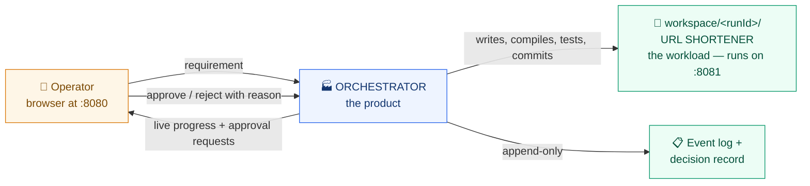
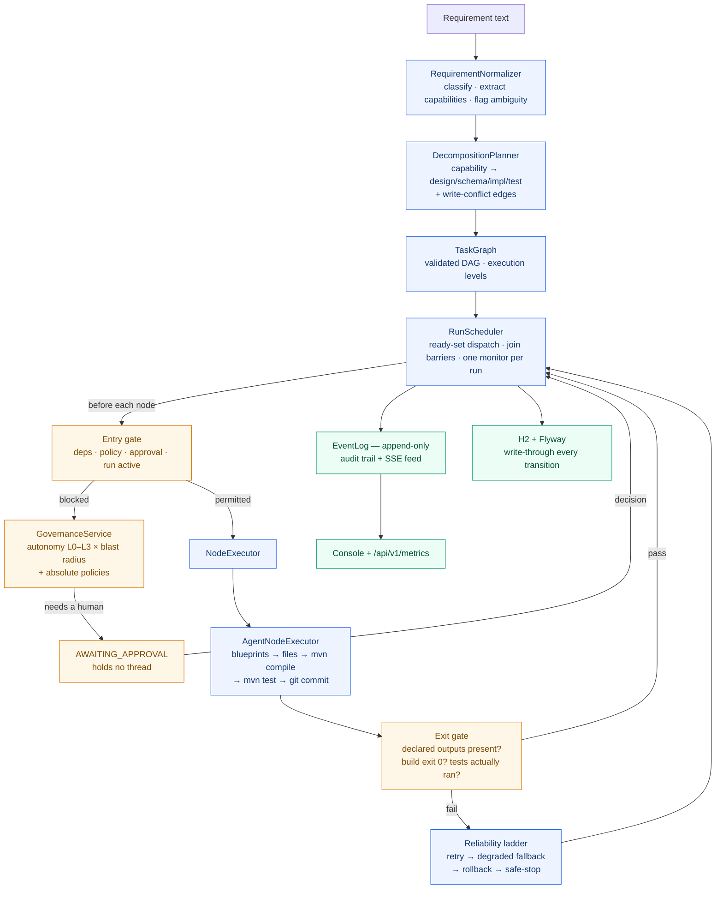
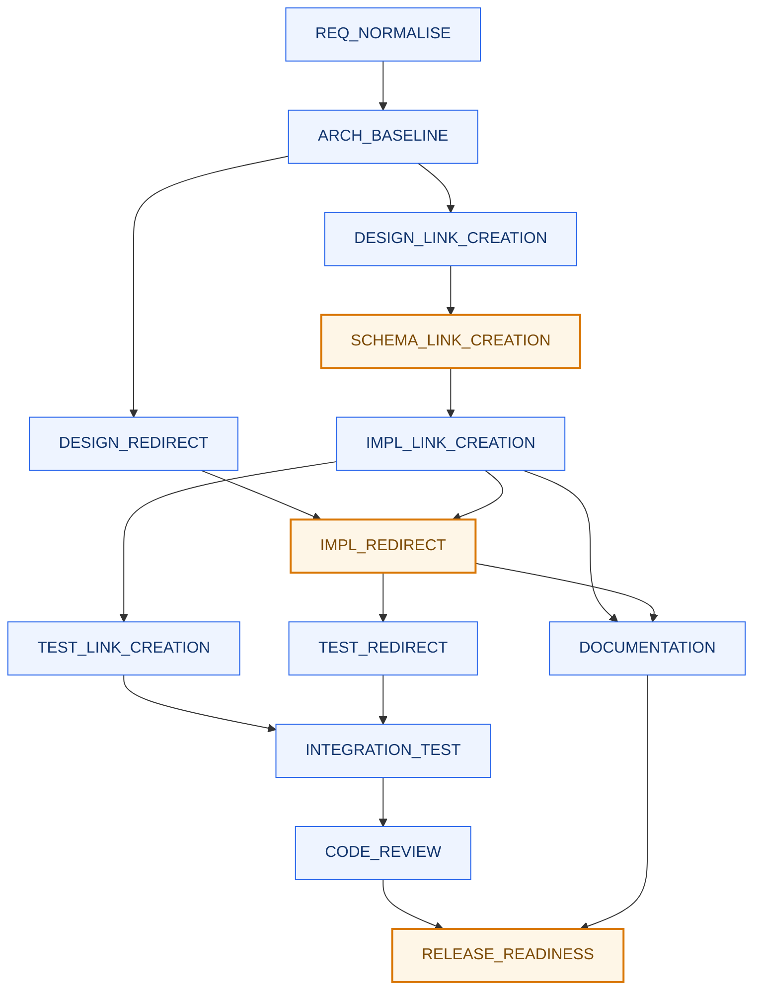

# Agentic SDLC Orchestrator

**The orchestrator is the product. The URL shortener is the workload it builds.**

Give it a requirement in English. It decomposes that into a dependency graph, executes the graph with
real parallelism, stops for a human wherever policy says it must, writes real Java, compiles it, runs
its tests, commits each node separately — and refuses to mark anything green that cannot show
evidence.

Section 4 of the brief describes a workflow engine, not a URL shortener. The shortener exists to
prove the engine produces working software rather than a plan document.

---

## Architecture

### The two programs



Two separate programs. The orchestrator runs on **8080**; the service it generates runs on **8081**.
Both can run at once.

### Inside the orchestrator



### A greenfield run's graph

Orange stops for a human. Side-by-side boxes run in parallel.



`IMPL_REDIRECT` and `IMPL_LINK_CREATION` are serialised by a **CONTROL** edge because both write
`LinkService.java` — the planner detects write conflicts and orders them, recording the reason.

### The five rules everything else follows from

| # | Rule | Consequence |
|---|---|---|
| 1 | **A node may never declare its own success** | The exit gate checks declared outputs, compiler exit code and test totals. A node reporting success while producing nothing *fails*. `tests.run == 0` fails — a suite that ran nothing proves nothing. |
| 2 | **Waiting is a state, never a blocked thread** | `AWAITING_APPROVAL` and `RETRYING` hold nothing. Other branches keep running; a run can wait days and survive a restart. |
| 3 | **Everything read and written is declared** | Gives content fingerprints for re-planning, least-privilege context per agent, and the evidence the gate checks. |
| 4 | **Autonomy tunes approval; policy is absolute** | A `DENY` halts an L3 run exactly as it halts an L0 one. A task assigned to a human is never executed by an agent, at any level. |
| 5 | **Failure is local and reversible** | A failed node blocks only its transitive dependents. One git commit per node, so rollback is a precise `git revert`. |

### Component map

| Package | Responsibility |
|---|---|
| `requirement` | Normalise text, classify GREENFIELD/BROWNFIELD/AMBIGUOUS, build the ambiguity register |
| `plan` | Capability-driven decomposition, DAG validation, write-conflict resolution, execution levels |
| `execution` | Async scheduler, node state machine, entry/exit gates, append-only event log |
| `governance` | Autonomy matrix, policy engine, approvals, decision record |
| `reliability` | Bounded retry, timeouts, degraded fallback, compensating rollback |
| `replan` | Fingerprints, plan diff, invalidation cascade, oscillation bounds |
| `sandbox` / `tools` | Path jail, executable allowlist, content screening, `mvn` and `git` |
| `agent` | The blueprint runtime and the real file-writing executor |
| `metrics` / `api` | Reliability metrics derived from the event log; REST + SSE + console |

---

## Prerequisites

```bash
sudo apt update && sudo apt install -y openjdk-21-jdk git
export JAVA_HOME=/usr/lib/jvm/java-21-openjdk-amd64
```

Maven comes from the wrapper.

> **Never run the build or the server with `sudo`.** It leaves root-owned `target/`, `workspace/`
> and `.git` directories, and every later command fails with a `Permission denied` that looks like a
> code problem. Recover with `sudo chown -R $USER:$USER /home/inpixon/learning`.

## Build

```bash
cd orchestrator
./mvnw test          # 196 tests, ~2 minutes
```

## Run

```bash
./mvnw spring-boot:run -Dspring-boot.run.arguments=\
"--orchestrator.executor=agent --orchestrator.node-timeout-ms=900000"
```

Open **http://localhost:8080**.

| Flag | Why it matters |
|---|---|
| `--orchestrator.executor=agent` | **Without it the run is simulated** — it finishes in seconds and writes no files. The default is `simulated`, which is useful for demonstrating scheduling and governance quickly. |
| `--orchestrator.node-timeout-ms=900000` | Real Maven builds exceed the 30-second default and get killed mid-build. |

To start from a clean slate: stop the server and `rm -rf data workspace`.

---

## Testing

Everything below is driven from the browser. Each scenario ends with an independent `mvn test` on
the generated code — do not take the orchestrator's word for it.

### Scenario 1 — Greenfield

**Requirement:** `Build a URL shortener service with shorten and redirect APIs`

New Run → **Greenfield** preset → Start. Approve when the amber panel appears.

| Expected | Value |
|---|---|
| Plan shape | 13 tasks, 17 dependencies, GREENFIELD |
| Approvals | 3 — `SCHEMA_LINK_CREATION`, `IMPL_REDIRECT`, `RELEASE_READINESS` |
| Final | `COMPLETED`, 13/13 succeeded |
| Artifacts | 23 files, 13 git commits (one per node) |

```bash
cd workspace/<runId>
git log --oneline          # 13 commits, dependency order
mvn test                   # Tests run: 20, Failures: 0, Errors: 0
```

Run it:

```bash
mvn spring-boot:run        # binds :8081

curl -s localhost:8081/api/v1/links -H 'Content-Type: application/json' \
  -d '{"url":"https://example.com/a/very/long/link"}'
# -> 201 {"code":"aB3xY7q","shortUrl":"http://localhost:8081/aB3xY7q",
#         "targetUrl":"https://example.com/...","active":true}

curl -si localhost:8081/aB3xY7q | head -2      # 302, Location: the original
```

`POST /api/v1/links` also takes `alias` (409 if taken) and `expiresAt`. `GET /api/v1/links/{code}`
inspects; `DELETE` deactivates.

### Scenario 2 — Brownfield

**Requirement:** `Add click analytics and rate limiting to the existing service`

A change to existing code needs existing code, so this run starts from scenario 1's workspace. Pass
`baseRunId` — the console's New Run screen has the field, or:

```bash
curl -s localhost:8080/api/v1/runs -H 'Content-Type: application/json' \
  -d '{"requirement":"Add click analytics and rate limiting to the existing service",
       "baseRunId":"<scenario-1-runId>"}'
```

| Expected | Value |
|---|---|
| Plan shape | 14 tasks, BROWNFIELD — `IMPACT_ANALYSIS` inserted before design |
| Approvals | 4 — schema, both implementations, release |
| Final | `COMPLETED`, 14/14 succeeded |
| Artifacts | Baseline seeded (22 files copied), then `V2__clicks.sql`, analytics and rate-limiting classes |

```bash
cd workspace/<runId>
mvn test                   # 34 tests across 7 classes, 0 failures
```

**What to look for:** `docs/impact-analysis.md` is written *before* any code changes, and the
approval on `SCHEMA_CLICK_ANALYTICS` cites three converging rules — autonomy level, CHG-02
(migrations), CHG-03 (hot path). The strictest wins; a `WARN` never downgrades an `APPROVE`.

### Scenario 3 — Ambiguous

**Requirement:** `Make the URL shortener more reliable and faster`

Start it with `baseRunId` set to scenario 1, same as above.

**Stage 1 — it refuses to guess.** The plan is 2 tasks and stops at `CLARIFY`, gated by COM-01
("work assigned to a human must not be performed by an agent"). The ambiguity register names what is
unclear and offers options:

> `reliable` — *"unquantified. Which failure does it need to survive?"* → uptime under load / data
> durability / graceful degradation
>
> `faster` — *"no target or baseline. What is being measured?"* → redirect latency at p99 / creation
> throughput / cold-start

**Stage 2 — a human clarifies.** Run controls → **Re-plan…**:

```
Add caching for redirect latency and monitoring for reliability
```

| Expected | Value |
|---|---|
| Re-plan outcome | `AWAITING_PLAN_APPROVAL` — the plan change *itself* is governed |
| Diff | 15 added, `CLARIFY` removed, `REQ_NORMALISE` retained |
| Final | `COMPLETED`, 16/16 succeeded |

```bash
cd workspace/<runId>
mvn test                   # 28 tests, 0 failures
```

**What to look for:** the graph visibly changes shape from 2 nodes to 16, and completed work is
carried forward rather than redone.

### Failure handling

Each is one flag, in simulated mode (`--orchestrator.executor=simulated`).

| What to prove | Flag | What you see |
|---|---|---|
| A false claim of success is refused | `--orchestrator.simulation.omit-evidence-tasks=IMPL_LINK_CREATION` | Executor reports success, produces nothing, node fails anyway |
| Failure stays local | `--orchestrator.simulation.fail-tasks=IMPL_RATE_LIMITING` | Only transitive dependents block; other branches complete |
| Retry then degraded fallback | `--orchestrator.simulation.fail-tasks=TEST_REDIRECT` | `RETRY_SCHEDULED` → `RETRIES_EXHAUSTED` → `FALLBACK_ATTEMPTED` → `NODE_DEGRADED`, counted separately from succeeded |
| A hung node is killed | `--orchestrator.simulation.slow-tasks=IMPL_CACHING --orchestrator.node-timeout-ms=3000` | `NODE_TIMED_OUT` |
| Partial rollback escalates | `--orchestrator.simulation.compensation-failures=SCHEMA_LINK_CREATION` | Rollback **halts** and leaves the node `BLOCKED` rather than compounding a partial state |

**Rejection** needs no flag: reject any approval with guidance. The node `FAILED`, its dependents
`BLOCKED`, already-finished work stays `SUCCEEDED`, and the guidance is on the decision record.

**Restart recovery** needs no flag: let a run park on an approval, `Ctrl-C` the server, start it
again. The log prints `Recovered N plan(s) and N run(s); 1 still live`; the same approval is waiting
and approving it resumes the run.

### Verification checklist

| # | Claim | How it was checked |
|---|---|---|
| 1 | The orchestrator is correct | `./mvnw test` — 196 tests |
| 2 | A requirement becomes a dependency graph | 13 / 14 / 2 nodes for the three scenarios |
| 3 | Independent nodes run in parallel | Event log shows two `NODE_STARTED` before either `NODE_SUCCEEDED` |
| 4 | Policy stops high-impact work | The run reaches `AWAITING_INPUT` unprompted |
| 5 | Waiting costs no thread | Other branches keep succeeding while one node waits |
| 6 | Decisions are attributable | `/runs/{id}/decisions` gives actor, choice, rationale |
| 7 | Rejection propagates correctly | Node `FAILED`, dependents `BLOCKED`, rest `COMPLETED` |
| 8 | It writes real, compiling code | `mvn test` in the workspace — 20 / 35 / 29 tests |
| 9 | The generated service works | `curl` shorten + redirect on :8081 |
| 10 | Work is attributable node by node | `git log --oneline` — one commit per node |
| 11 | State survives a restart | Kill mid-run, restart, approval still pending |
| 12 | Metrics distinguish "no data" from zero | `/api/v1/metrics` on a fresh start omits rates rather than reporting `0` |

### API, if you prefer curl

| Method | Path |
|---|---|
| `POST` | `/api/v1/decompose` — plan only, executes nothing |
| `POST` | `/api/v1/runs` — `{requirement, autonomyLevel?, baseRunId?}` |
| `GET` | `/api/v1/runs/{id}` · `/events` · `/decisions` |
| `POST` | `/api/v1/runs/{id}/pause` · `/resume` · `/stop` · `/rollback` · `/replan?guidance=` |
| `GET` | `/api/v1/approvals?runId=` — ids are `apr-…`, not `run-…` |
| `POST` | `/api/v1/approvals/{id}/approve?decidedBy=&note=` · `/reject?decidedBy=&guidance=` |
| `GET` | `/api/v1/policies` · `/api/v1/metrics` · `/api/v1/runs/{id}/stream` (SSE) |

Everything the console does is one of these calls; there is no orchestration logic in the browser.

---

## Limitations

Stated rather than hidden — each is a real boundary, not an oversight.

- **The agent runtime emits pre-written blueprints; it does not synthesise code.** What is real is
  everything around it: when each piece is written, whether it compiles, whether its tests pass, and
  the gate refusing it if not. `AgentRuntime` is the single class an LLM-backed runtime replaces.
- **Tool work serialises per run.** All nodes share one working tree, so a per-run lock guards the
  tools — two concurrent Maven builds corrupt each other's `target/`. The *scheduler* is genuinely
  parallel; the tools queue. The fix is a git worktree per branch, merged at the join.
- **The exit gate checks that declared outputs exist, not that they are still correct.** Two nodes
  legitimately writing the same file is a real hazard: during development, `IMPL_RATE_LIMITING`
  silently re-emitted a pre-analytics `RedirectController` and deleted click recording. Everything
  compiled and every test passed. A test asserting the behaviour end-to-end is what caught it — and
  that test now ships in the generated project.
- **`workspace/` accumulates**, one repository per run, deleted by nobody.
- **No `/swagger-ui`.** Deliberate: every endpoint is documented above, and springdoc is a dependency
  and a classpath scan for no marginal evidence.
